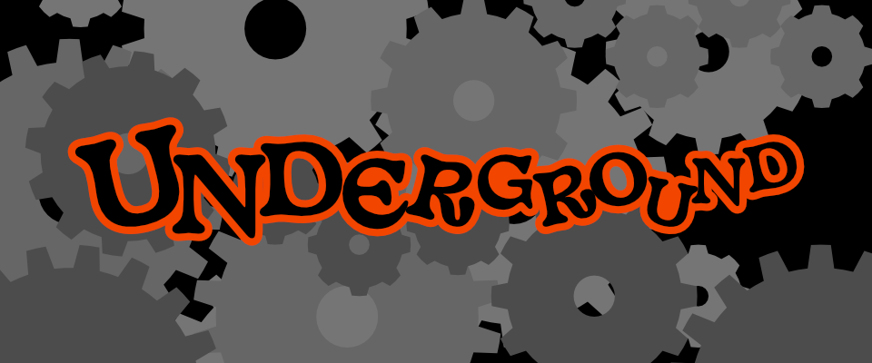

*Your only child has been taken by goblins to the underground city of Ix, where they mine coal and tend to the great clockwork contraptions that run your perfect world.*

*You want to remember their name. You want to hold them in your arms, again. You want to bring them home.*

Journey into the Underground by yourself or with a team to find your child in this short, two-page TTRPG of urban fantasy. Explore a steam-powered world filled with goblins, monstrous clockwork gears, and endless spiral staircases.

Underground is a **Push-powered** game published using the [Push SRD](https://capacle.itch.io/push). The rules-light, narrative-forward Push system features:

- A single mechanic to solve all your conflicts.
- GM-less play: share the narrative with your friends, or play it solo!
- Quest-oriented design: the setting is an adventure!
- Pick-up-and-play: zero prep, just sit at the table and the mechanics will push the story forward with you.

## What you need

To play Underground, you’ll need the following in either analogue or digital form:

- An active imagination, a desire to be creative, and a place where you can focus.
- Some scratch paper and copies of the character sheet at the end of this book.
- A handful of six-sided dice (abbreviated D6).

## What you get

- **Two-page version** of the game. You can print it front and back on a single sheet of paper and you're ready to go!
- Custom **character sheet.**
- **Booklet version** of the game.

## How to buy



*For 1 to 6 players. Recommended for ages 10 and up.*

Underground is copyright © 2022 by David Garrett. Licensed for use under the [Creative Commons Attribution 4.0](https://creativecommons.org/licenses/by/4.0/) license.

This work is based on the Push SRD, developed, authored, and edited by [Cezar Capacle](https://capacle.itch.io/), and licensed for our use under the [Creative Commons Attribution 4.0 International](https://creativecommons.org/licenses/by/4.0/) license.
